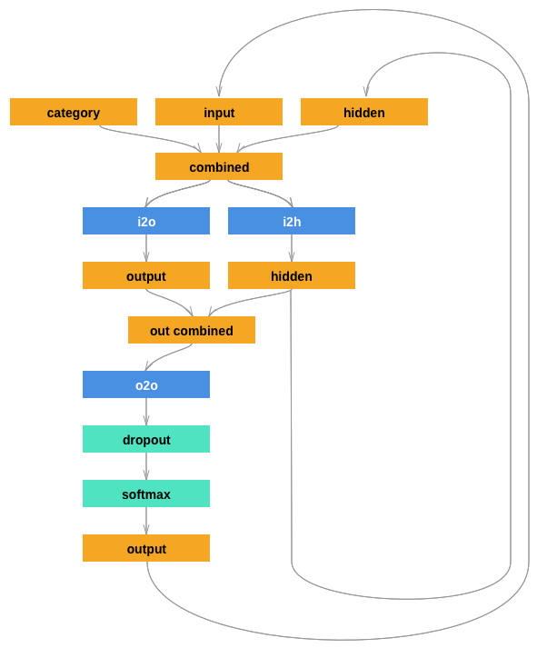
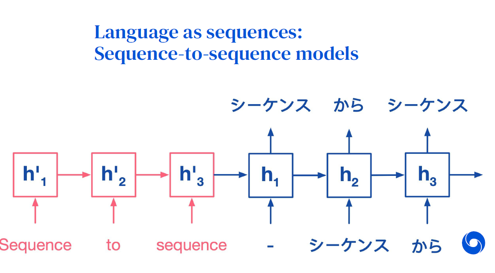

# MachineLearning

## Conventional ML Algorithms
   1. [Implementation of K-nearest Neighbours (`KNN`) and Linear Regression](./A1)
   
   2. [Implementation of (1) Mixtures of Gaussians and (2) Logistic Regression for Classification](./A2)
   
   3. [Non-linear regression](./A3)
      - Regularized Generalized Linear Regression
      - Bayesian Generalized Linear Regression
      - Gaussian Process Regression (Kernel Method)

## Modern ML Algorithms (Deep Learning)
   4. [Convolutional Neural Networks (`CNN`s) in `TensorFlow`](./A4)
      - Experiment with Fully Connected Neural Networks and Convolutional Neural Networks
      
   5. [Sequence Models with Recurrent Neural Network (`RNN`) in `PyTorch`](./A5)
      - Encoder Implementation with Linear Hidden Units, `GRU`s and `LSTM` Units 
         - Application: Predicting which language a name is from based on the spelling
         
         
         
      - Decoder Implementation
         - Application: Generating names from languages
         
         
         
       - Natural Language as Sequences: Sequence to Sequence Model (with `Attention`) Implementation
         - Translating from one language to another
          
      
   
